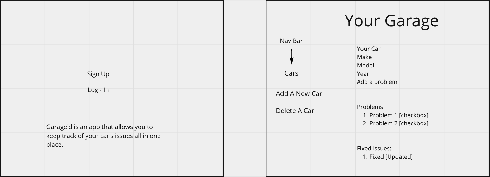
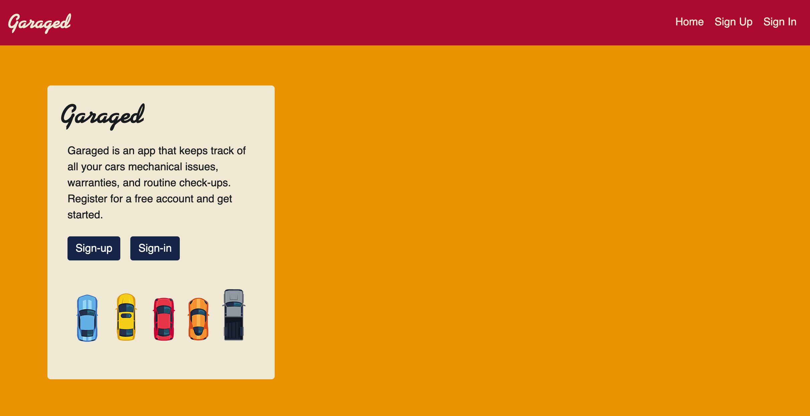
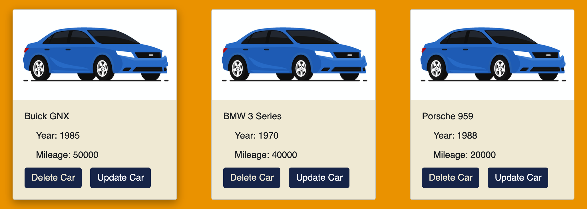

Garaged App

## Repo URL:
[Client](https://github.com/akramshah/garaged-client)
[API](https://github.com/akramshah/garaged-app)

## Instructions:
Click on the Github pages url to view website. Use sign-up page to create account. Sign in, and under your user drop down menu add a car. Update or delete cars using the buttons on the cards for each car.

## Description:
The Garaged web application is a website that allows you to log specific information about your car all in one place (warranties, mechanical issues, etc.) In the MVP of the app, you can add and edit your Garage. In later versions, you will be able to add and edit issues, open to a specific car in your garage, and find mechanics for your fixes.

## Planning Story
I began building the barebones of the app, building and testing the authorization events. I then worked on a few CSS features to make it more user-friendly. Next, I worked on the CRUD actions for the Garage. Finally, after I had gotten the CRUD actions to work, I styled and refined the website.

## User Stories
- As a user I want to: Sign Up
- As a user I want to: Sign In
- As a user I want to: Change my password
- As a user I want to: Sign Out
- As a user I want to: Create a car
- As a user I want to: Edit a car
- As a user I want to: Delete a car

## Technologies Used
- React
- NodeJS
- Axios
- HTML
- SCSS
- React-Bootstrap
- Bootstrap
- NPM
- JSX
- Javascript

## WireFrames

